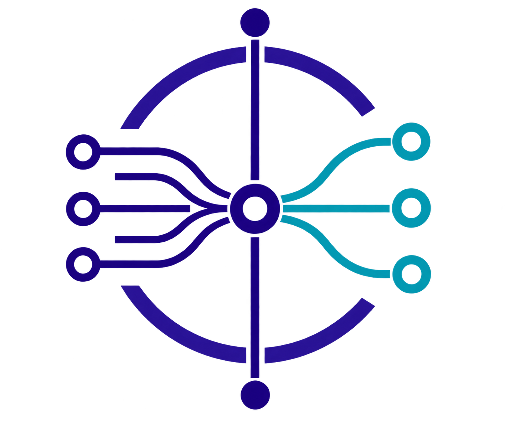

<div align="center">



# MCP Conductor

**The control plane for your MCP ecosystem.**

_Route. Govern. Observe. Evaluate. Improve._

[](go.mod)
[](LICENSE)
[](#roadmap)
[](CONTRIBUTING.md)

</div>

MCP gateway and control plane for **aggregation, routing, governance, observability, testing, evaluation, and optimization** of MCP servers. MCP Conductor is **not just another MCP proxy** — its long-term value is **Runtime Governance + MCP Quality Engineering**: governing MCP traffic on one side and MCP quality on the other, across the whole MCP lifecycle (`Develop → Register → Test → Evaluate → Deploy → Observe → Optimize → Re-evaluate`).

> **当前阶段：v0.1.0 (MVP)** — 一个 Go 二进制承载 Gateway + Control Plane，先跑通「注册 Server → 自动发现 Tools → 统一端点聚合 → 按命名空间路由调用 → 记录观测」的最小闭环。

---

## Overview

- **Aggregation** — 一个统一 MCP Endpoint（`/mcp`）聚合多个上游 MCP Server；自动发现 Tools，并以 **Server 命名空间**（如 `university.search_policy`）从根上解决 Tool Name Collision。
- **Gateway** — 协议校验 → 认证 → 授权 → 限流 → 路由 → 负载均衡 → 上游调用 → 观测的中间件管线，每个阶段职责单一。
- **Governance** — 领域模型优先：Server / Tool / Route / Policy / Credential / Traffic，配以 Control Plane API（`/api/*`）。
- **Observability** — 每次 `tools/call` 记录 `request_id / trace_id / server / tool / status / latency / timestamp`，按采样率落库并输出结构化日志；默认不记录敏感参数/返回值。

## Features (v0.1)

| 能力 | 状态 |
| --- | --- |
| MCP Server Registry + CRUD | ✅ MySQL 5.7+ 驱动（`internal/storage/mysql`）；默认 memory 可通过 `database.driver=mysql` 切换 |
| 自动发现 MCP Tools + Tool Namespace | ✅ |
| 统一 MCP Endpoint（`tools/list` 聚合、`tools/call` 路由） | ✅ streamable HTTP 无状态模式 |
| 健康检查（initialize 握手 + 周期巡检） | ✅ |
| 路由解析 + Round Robin 负载均衡（健康感知） | ✅ |
| 认证（数据面 API Key + 控制面管理令牌） | ✅ API Key 密钥 HMAC-SHA256 哈希落库、明文仅创建时一次性下发、限于 /mcp 白名单；控制面 /api 用静态 `operator_token`（数据面凭据不可访问控制面）；默认关闭 |
| Gateway→上游 Credential 管理（API Key / Static Token） | ✅ 值 AES-256-GCM 加密落库；经 `json:"-"` 不下发 API、不入日志；按 Server 注入上游请求头 |
| 按 Key×Tool 白名单授权（跨 Server 聚合） | ✅ 每个 key 只可见/可调被授权工具（支持 `server.*`/`*` 通配）；每工具可配调用参数与请求头；非管理身份回退遗留策略规则 |
| Memory（令牌桶）/ Redis 限流，支持按 Key 独立配额 | ✅ 默认关闭 |
| Request Logging + 基础 Metrics（P50/P95/P99） | ✅ 应用层聚合 |
| Vue3 Console（Ant Design Vue + ECharts） | ✅ 构建后嵌入二进制 |
| MCP Manual Test（Console 内联） | ✅ |
| Docker / Docker Compose / Makefile | ✅ |

**明确不属于 v0.1**：LLM Judge、Python Evaluation Worker、AI Optimization、Traffic Replay、复杂 ABAC、Kafka、ClickHouse、Kubernetes Operator、Service Mesh、微服务拆分。

## Architecture

```
MCP Client / AI Agent
        │  tools/list · tools/call（统一端点 /mcp）
        ▼
┌──────────────────────── MCP Conductor Gateway ────────────────────────┐
│  request_id → logging → auth → rate limit ─（HTTP 中间件）           │
│  tools/list：聚合 Tool Registry                                      │
│  tools/call：authorize → route → balance → upstream → record         │
└──────────────────────────────┬────────────────────────────────────────┘
                               ▼
                       Upstream MCP Servers
  +  Control Plane: /api/*（Registry / Tool / Route / Policy / Credential / 观测）
```

- **Monorepo + 模块化单体**：单一 Go Backend + 独立 Vue3 Console（`npm run build` 后经 `go:embed` 内嵌进二进制，`./mcp-conductor` 即可访问）。
- **领域模型优先**：`Server / Tool / Route / Policy / Credential / Traffic`（`Evaluation / Dataset / TestCase / Version` 预留边界）。
- **接口优先但克制**：核心模块面向 interface（`storage` / `ratelimit` / `balancer` / `router`）；无 Redis 也能以 memory 模式启动。

```
cmd/conductor        # 入口：装配 + 信号处理
internal/
  app               # 依赖装配与生命周期
  config            # config.yaml + CONDUCTOR_* 环境变量（分组）
  model             # 领域模型
  errs              # 统一错误模型 code/message/request_id
  storage           # 存储接口 + memory 实现（mysql 5.7 下一阶段）
  mcp               # MCP 协议最小层（手写 JSON-RPC，streamable HTTP 无状态）
  mcpclient         # 上游 Server 适配：发现 / 调用 / 健康 Probe
  registry          # Server CRUD + Tool 发现 / 命名空间聚合
  router            # 工具名 → (Server, 实例) 解析
  balancer          # 负载均衡（RoundRobin，健康感知）
  ratelimit         # memory 令牌桶 / redis 固定窗口
  auth · policy     # 认证（控制面 operator token / 数据面 API Key）· Tool 级 RBAC
  health            # 周期健康巡检
  observability     # 指标聚合 + 调用日志（采样 / 不记敏感体）
  console           # go:embed 前端 dist
  gateway           # HTTP 组装 / 中间件 / 统一 MCP 端点 / 控制面
web/                # Vue3 + TS + Vite + Pinia + Ant Design Vue + ECharts
migrations/         # MySQL 5.7 兼容 DDL
examples/mock-mcp   # 演示用最小 MCP Server
```

底层设计详见 [docs/architecture/overview.md](docs/architecture/overview.md)，数据库兼容契约见 [docs/architecture/database.md](docs/architecture/database.md)。

## Quick Start

### 前置要求

- Go ≥ 1.25（后端）、Node ≥ 20（前端构建）、Docker（可选，用于 Compose）。
- 国内拉取 Go 依赖若直连 `proxy.golang.org` 不通，先设置镜像：`go env -w GOPROXY=https://goproxy.cn,direct`。

### 方式一：Docker（仅应用容器，数据库/Redis 用宿主机实例）

Compose 只构建/运行应用本身，**不再启动 MySQL/Redis 容器**——数据库与 Redis 默认连宿主机（容器内经 `host.docker.internal` 访问）。

```bash
CONDUCTOR_DB_PASSWORD=<你的本地 MySQL 密码> docker compose up --build
# Console:  http://localhost:8080
# MCP 端点: http://localhost:8080/mcp
```

- 数据库：默认 `mysql`，连宿主机 `host.docker.internal:3306` 的 `conductor` 库（库表需先执行 `migrations/0001..0003`）。账号可用 `CONDUCTOR_DB_USER / CONDUCTOR_DB_PASSWORD / CONDUCTOR_DB_HOST / CONDUCTOR_DB_PORT / CONDUCTOR_DB_NAME` 覆盖；`CONDUCTOR_DATABASE_DRIVER=memory` 可脱离数据库运行。
- Redis：仅当同时开启 `CONDUCTOR_REDIS_ENABLED=true` 与 `CONDUCTOR_RATELIMIT_ENABLED=true` 时才用于分布式 per-key 限流，默认关闭（本机 Redis 若只监听 `127.0.0.1` 需放开监听才能被容器访问）。

### 方式二：一键构建（带真实 Console 的单二进制，推荐）

Console 前端是经 `go:embed` 在编译期打包进二进制的，**只改代码不重建前端/二进制是看不到界面变化的**。

```bash
make web-install        # npm --prefix web install（首次）
make build              # 构建前端并嵌入 → bin/mcp-conductor
./bin/mcp-conductor     # 访问 :8080 即用真实 Console
```

> 仅调试后端、不需要 UI 时可 `make build-backend`（或 `go run ./cmd/conductor`）——此时 :8080 打开的是占位 Console（提示先构建前端），并非最新界面。

开发期前端热更新：另开终端 `make web-dev`（`:5173`，已代理 `/api` 与 `/mcp` 到后端），浏览器访问 `http://localhost:5173` 看最新界面。

### 最小闭环演示（5 分钟）

```bash
# 1. 启动演示上游 MCP Server（提供 search/detail 两个回显工具）
go run ./examples/mock-mcp        # :9000/mcp

# 2. 注册该 Server（名称决定对外命名空间）
curl -s -X POST http://localhost:8080/api/servers \
  -H 'Content-Type: application/json' \
  -d '{"name":"Mock","endpoint":"http://localhost:9000/mcp","transport":"https"}'

# 3. 聚合后的工具（gateway_name = mock.search / mock.detail）
curl -s http://localhost:8080/api/tools

# 4. 通过统一端点调用，自动路由回上游
curl -s -X POST http://localhost:8080/mcp -H 'Content-Type: application/json' \
  -d '{"jsonrpc":"2.0","id":1,"method":"tools/call","params":{"name":"mock.search","arguments":{"q":"policy"}}}'
# → {"jsonrpc":"2.0","id":1,"result":{"content":[{"type":"text","text":"[search] 收到参数: map[q:policy]"}]}}
```

## API Reference

### 统一 MCP 端点 `POST /mcp`

streamable HTTP 无状态模式（`GET` 返回 405 以引导客户端走纯 POST）。支持方法：

| 方法 | 说明 |
| --- | --- |
| `initialize` | MCP 握手（默认协商 `2025-11-24`） |
| `tools/list` | 返回全部 Server 聚合后的 Tool 列表（namespaced） |
| `tools/call` | 按 `gateway_name` 调用，自动授权 → 路由 → 均衡 → 转发上游 |

认证开启后：
- `/mcp`（数据面）：携带**数据面 API Key**（`Authorization: Bearer <key>` 或 `X-Api-Key: <key>`），只可调该 key 白名单内的工具；
- `/api/*`（控制面）：仅接受**管理令牌** `auth.operator_token` 或经 `POST /api/auth/login` 签发的会话令牌（同样放 `X-Api-Key`/`Bearer`）。数据面 API Key 访问 `/api` 会得到 403，也不能用来登录换取会话。

调用失败统一以 `isError: true` 结果返回，不暴露内部细节。

### 控制面 REST `GET /api/*`

统一信封：`{ "code", "message", "request_id", "data" }`。**开启认证后，以下端点均要求管理令牌 `operator_token` 或登录会话**；数据面 API Key 访问返回 403。端点一览：

| 方法 / 路径 | 说明 |
| --- | --- |
| `GET/POST /api/servers` | 列表 / 注册（注册即发现 Tools） |
| `GET /api/servers/{id}` | 详情 |
| `PATCH /api/servers/{id}/toggle` | 启用 / 禁用 |
| `DELETE /api/servers/{id}` | 删除（级联删 Tools） |
| `POST /api/servers/{id}/test` | 测试连接并重新发现 Tools |
| `GET /api/servers/{id}/tools` · `.../credentials` | Server 下的 Tools / 凭证 |
| `GET/POST /api/tools` · `/api/routes` · `/api/policies` | 聚合工具 / 路由 / 策略管理 |
| `GET /api/metrics` | 指标快照（p50/p95/p99、成功率） |
| `GET /api/logs` | 最近调用日志（Request Log） |
| `GET /healthz` · `/readyz` | 存活 / 就绪探针 |

### 错误码

`protocol_error` / `authentication_error` / `authorization_error` / `rate_limit_error` / `route_error` / `upstream_error` / `timeout_error` / `invalid_argument` / `not_found` / `internal_error`。控制面返回 HTTP 状态码 + 信封；`/mcp` 返回 JSON-RPC 错误对象。

## Configuration

配置 = **config.yaml + 环境变量**（环境变量优先级更高，命名 `CONDUCTOR_<GROUP>_<FIELD>`）：

```bash
cp config.example.yaml config.yaml
CONDUCTOR_AUTH_ENABLED=true \
CONDUCTOR_AUTH_OPERATOR_TOKEN="change-me-operator-token" \
CONDUCTOR_AUTH_TOKEN_SECRET="<32 位 hex>" \
CONDUCTOR_AUTH_API_KEYS="client-a:dev-key" \
go run ./cmd/conductor
```

| 分组 | 关键项 | 环境变量示例 |
| --- | --- | --- |
| `server` | host / port | `CONDUCTOR_SERVER_PORT=8080` |
| `database` | driver（memory/mysql）/ dsn | `CONDUCTOR_DATABASE_DSN=user:pwd@tcp(host:3306)/conductor?parseTime=true&charset=utf8mb4` |
| `redis` | enabled / addr / password | `CONDUCTOR_REDIS_ENABLED=false` |
| `gateway` | upstream_timeout / max_concurrency | `CONDUCTOR_GATEWAY_UPSTREAM_TIMEOUT_MS=10000` |
| `ratelimit` | enabled / qps / burst | `CONDUCTOR_RATELIMIT_QPS=100` |
| `auth` | enabled / operator_token / token_secret / api_keys | `CONDUCTOR_AUTH_OPERATOR_TOKEN=<令牌> CONDUCTOR_AUTH_TOKEN_SECRET=<32 位 hex>` |
| `credentials` | encryption_key（AES-256，64 位 hex） | `CONDUCTOR_CREDENTIALS_ENCRYPTION_KEY=<hex>` |
| `logging` | level / format | `CONDUCTOR_LOGGING_LEVEL=info` |
| `observability` | record_body / sample_rate | `CONDUCTOR_OBSERVABILITY_SAMPLE_RATE=1.0` |

完整说明见 [config.example.yaml](config.example.yaml) 与 [.env.example](.env.example)。

### 数据库兼容目标：MySQL 5.7+

生产环境为 **MySQL 5.7**，因此迁移 / DDL / SQL 必须 5.7 可运行；**禁止 MySQL 8.0 专属特性**（Window Functions、CTE、Function Index、CHECK 兜底、MySQL 8 JSON 函数/索引等），需要时走 MySQL 5.7 兼容或应用层方案。详见 [docs/architecture/database.md](docs/architecture/database.md)。`migrations/0001_init_schema.sql` 与 `internal/storage/mysql` 驱动已在真实 MySQL 5.7 上实测（含重启持久化）。

```bash
# 用 MySQL 驱动启动（先确保数据库建好并应用迁移）
CONDUCTOR_DATABASE_DRIVER=mysql \
CONDUCTOR_DATABASE_DSN='conductor:conductor@tcp(localhost:3306)/conductor?parseTime=true&loc=UTC&charset=utf8mb4' \
  go run ./cmd/conductor
```

## Development

```bash
make web-install   # 安装前端依赖
make build         # 构建前端并产出带真实 Console 的单二进制（默认构建）
make run           # 一键构建并运行（:8080，带真实 Console）
make build-backend # 仅编译后端（用当前 internal/console/dist，调试后端用）
make web-dev       # 前端热更新 :5173（代理 /api、/mcp）
make test          # 后端单元测试
make vet           # go vet 静态检查
make docker-up     # Compose 一键启动（MySQL 5.7 / Redis / Conductor）
```

- **后端约定**：统一错误模型与结构化日志（不打印 Credential、Token 与完整敏感 MCP payload）；核心模块测试优先（Router / Balancer / Rate Limiter / Policy / Tool Namespace）。
- **前端约定**：基础设施管理平台风格（现代、克制、高信息密度），Ant Design Vue + ECharts + Pinia，Payload 不可达时保持空态。
- **测试**：`go test ./...` 覆盖 7 个包（含 Tool Name Collision 回归、真实 JSON-RPC 握手链路）。

## Examples

- [`examples/mock-mcp`](examples/mock-mcp) — 演示用最小 MCP Server（search/detail 两个工具，监听 `:9000/mcp`，可用 `MOCK_PORT` 覆盖），用于本地闭环与手工测试。

## Roadmap

- **v0.1（当前）**：最小闭环 + 运维基础（Registry / 聚合 / 路由 / 治理 / 观测 / Console / Docker）。其中 **MySQL 5.7+ 持久化驱动已先行落地**（`internal/storage/mysql`，实测通过）。
- **v0.2 候选**：Credential 落库与上游凭据注入、SSE/stdio 上游接入、Route/Policy 管理页完善、数据库迁移工具与 CI 接通。
- **v0.3 候选**：Evaluation 边界（Dataset / TestCase / MCP Score 接口）、协议/Schema/性能测试、CI Quality Gate。
- **远期**：独立 Python Evaluation Worker、AI 优化建议、Traffic Replay、单逻辑 Server 多实例负载均衡。

## Contributing

欢迎贡献。请阅读 [CONTRIBUTING.md](CONTRIBUTING.md) 与 [CODE_OF_CONDUCT.md](CODE_OF_CONDUCT.md)；发现安全漏洞请按 [SECURITY.md](SECURITY.md) 私有渠道报告。

## License

[Apache-2.0](LICENSE) © mcp-conductor contributors